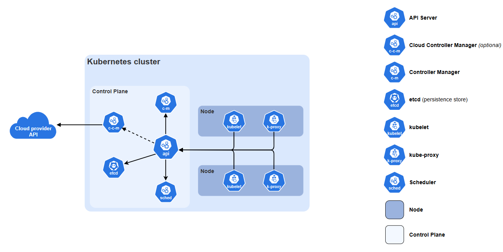

 

### Cloud-Native SIG present

# Kubernetes for Research Infrastructure: Core Concepts and Practical Use Cases

*20 August 2026, ACIT Hub Webinar*

---

# Agenda

1. Introductions
2. Introduction to Kubernetes
3. Use case 1: Lab in the Cloud
4. Use case 2: Jupyter Notebooks
5. Use case 3: Argo CD and Workflows
6. Summary
7. Q&A

---

<!-- _class: Title -->
<!-- _header: "" -->
# Introductions

---

## Who We Are

This webinar is run by the **Cloud-Native Special Interest Group**, a new community of RSEs/dRTPs for cloud-native technologies in research software and digital infrastructure.

Get involved at [https://cloudnative-sig.ac.uk/](https://cloudnative-sig.ac.uk/)
 

Current comittee includes; Laura Shemilt1, Alex Lubbock2, Piper Fowler-Wright2, Lewis Sampson3, and Tibor Auer4.

We are joined today by Dr Christopher Green3, Sys Admin in Scientific Computing Department

1BioFAIR, 2Rosalind Franklin Institute, 3UKRI STFC DAFNI, 4University College London

---

## The SIG so far

### We have been;

- Building networks through conference attendance
- Running Kubernetes introduction workshops for RSE/dRTPs
- Sharing knowledge of Kubernetes in the DRI community through CAKE fellowship
- Progressing towards being formalisied as a RSE Society.

### If you are interested
 Our workshops are available via our GitHub pages

<ul> 
<li> <a href="https://cloud-native-sig.github.io/stfcfeb26-intro-to-kubernetes/">Deploying a Webservice with Kubernetes</a> </li>

<li> <a href="https://github.com/cloud-native-sig/hpcdays26-pocket-sized-kubernetes"> Pocket sized Kubernetes:</a> For this one, to recreate with your own hardware, see the <a href="https://cloud-native-sig.github.io/hpcdays26-pocket-sized-kubernetes/extra-reading">extra reading section</a>.</li>

</ul>

---

<!-- _class: Title -->
<!-- _header: "" -->
# Introduction to Kubernetes

---

## What is Kubernetes (k8s)

Kubernetes is an open-source container orchestration platform to automate the deployment, scaling & management of containerised applications across groups of machines.

---

# Kubernetes vs Docker Compose

- **Docker:** run apps from built images in containers (sandboxed environments)
- **Docker Compose:** groups of containers with networking and storage on a single host
- **Kubernetes:** Orchestration pipeline for multi-host, multi-container applications.

<small>K8s allows complex containerised applications to run across multiple hosts in a cluster with powerful automation and management features.</small>

---

# Key Components

- **Node**: Physical or virtual machine
- **Control Plane**: Brains of cluster, acts based on current cluster state vs target state
- **Worker**: Run containerised applications using a container runtime.
- **Pod**: Smallest deployable unit&mdash;one or more containers sharing storage/network
- **Deployment**: Target state of identical pods serving an app
- **Service**: Network endpoint for pods

---

# Architecture Overview

<figure style="text-align: center; margin-top:-10px; margin-bottom:-30px; padding-top:0px;">
  
  <figcaption><small>Components of a Kubernetes cluster (<a href="https://kubernetes.io">kubernetes.io</a>)</small></figcaption>
</figure>

<!-- ---

# Kubernetes Distributions

- Vanilla k8s, i.e., [kubeadm](https://kubernetes.io/docs/reference/setup-tools/kubeadm/) (CNCF)&mdash;industry standard, fully-featured
- [RKE2](https://docs.rke2.io/) (Rancher Kubernetes Engine 2)&mdash;enterprise, security & compliance
- [K3s](https://k3s.io/) (Rancher)&mdash;Minimal resources & installation, e.g., IoT / Edge Computing
- [MicroK8s](https://canonical.com/microk8s) (Canonical)&mdash;Batteries included, lightweight
- [Minikube](https://minikube.sigs.k8s.io/docs/)&mdash;Single-node cluster for local development -->

---

# How Kubernetes Works

## Benefits

- **Declarative** Configuration. **GitOps:** Infrastructure as code, workflow managers, e.g., [Flux](https://fluxcd.io/), [ArgoCD](https://argoproj.github.io/cd/)
- General **resource management** including networking and security
- Ability to **scale clusters** to include additional cloud resources.
- Offer High Availability (HA) with **Self-Healing**.
 

> Example: On *node failure* Kubernetes distributes workload to other nodes

---

# How Kubernetes Works

## Difficulties

- Investing in an entirely new infrastructure
  - Research and Investigation
  - Migration
  - Upskilling

- Fast paced update cycle and dependency chains

---

# Kubernetes uses in Research Computing

Use if you need to manage multiple containerised services across different machines, or for:

- Automatic workload scaling based on demand
- Rolling updates with minimal downtime
- Self-healing resilient systems with high-availability
- Portability between on-prem and cloud infrastructure

---

# Kubernetes not uses in Research Computing

Adds complexity and not typically suitable for:

- Simple container applications on a single host (use Docker Compose)
- HPC job management (use SLURM)
- Large-scale parallel filesystems (e.g., Lustre)
- Services offered by a cloud provider or technology you are already invested in
---

<!-- _class: Title -->
<!-- _header: "" -->
# Use cases

---

<!-- _class: Title -->
<!-- _header: "" -->
<!--# Use case 1: Lab in the Cloud-->

<!-- _class: Title -->
<!-- _header: "" -->
<!--# Use case 2: Jupyter Notebooks-->

<!-- _class: Title -->
<!-- _header: "" -->
<!--# Use case 3: Argo CD and Workflows-->

<!-- _class: Title -->
<!-- _header: "" -->
# Wrap-up

---

# Cloud Native SIG

This webinar was brought to you by the Cloud-Native SIG and CAKE, with support from the Software Sustainability Institute
### You can join the CNSIG

<ul> 
<li> We are looking to grow the SIG so please join our Jisc mailing list for future updates.</li>
<ul>
<li> ✉️  <a href="https://www.jiscmail.ac.uk/cgi-bin/wa-jisc.exe?SUBED1=CLOUDNATIVE-SIG">cloudnative-sig@jiscmail.ac.uk</a> </li>

<li>🌐 <a href="https://cloudnative-sig.ac.uk">cloudnative-sig.ac.uk</a></li>
</ul>
<li>Or if you are deeply interested Kubernetes and Cloud-Native technologies join our committee. Contact any of us on email or LinkedIn to show interest </li>

</ul>

---

# Next up

**Join the CNSIG at RSECon 2026!** 

We will be running the *Deploying a Webservice with Kubernetes* workshop on Thursday the 10th September. If you're going to be at the conference feel free to come along, and catch the CNSIG throughout the event.

# Stay in touch

Feel free to contact the SIG after the webinar using the websites "Contact Us" page. [https://cloudnative-sig.ac.uk/pages/contact-us.html](https://cloudnative-sig.ac.uk/pages/contact-us.html)

---

<!-- _class: Title -->
<!-- _header: "" -->
# Thank you for listening, any questions?
